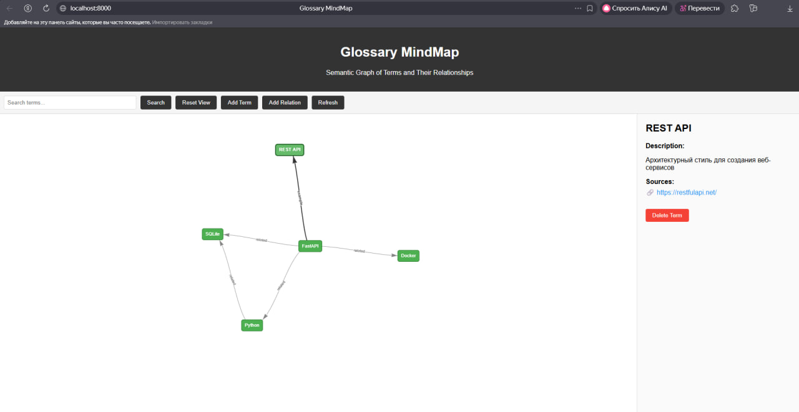
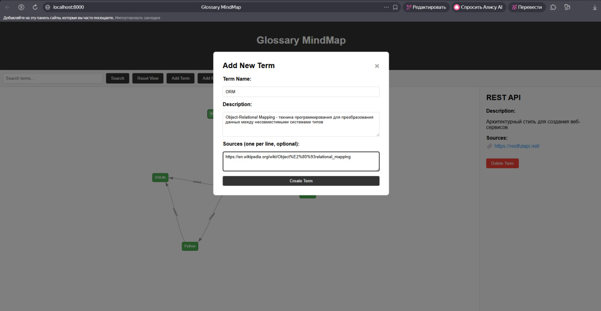
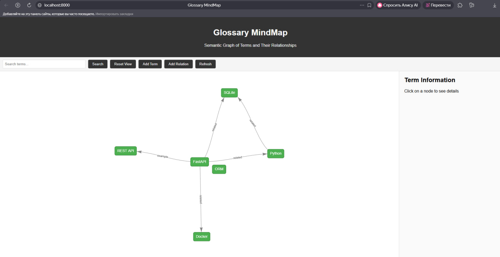
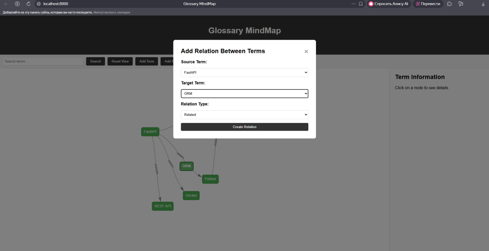
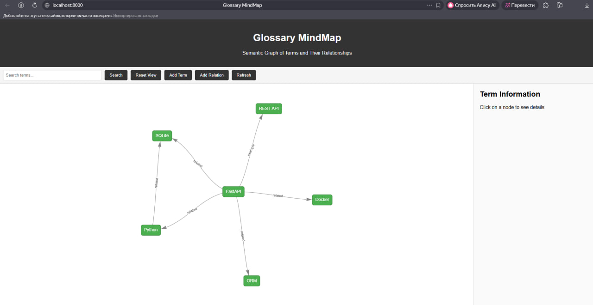

### Docker
```bash
docker compose up --build
```
  http://localhost:8000/terms

  docker build -t glossary-api 
  docker run --rm -p 8000:8000 glossary-api
  docker compose up --build

  скриншоты 





