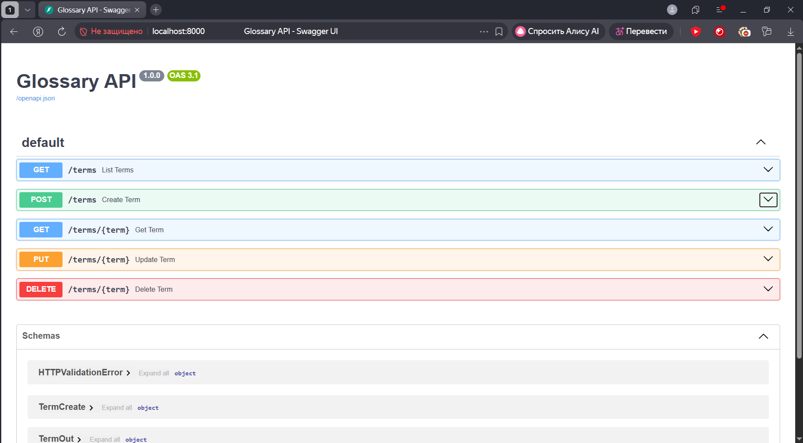
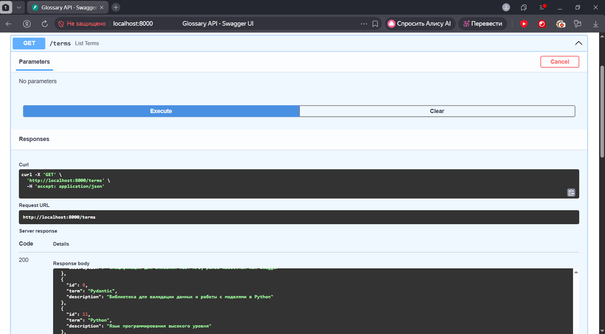
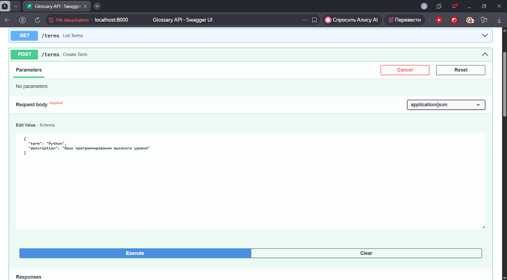
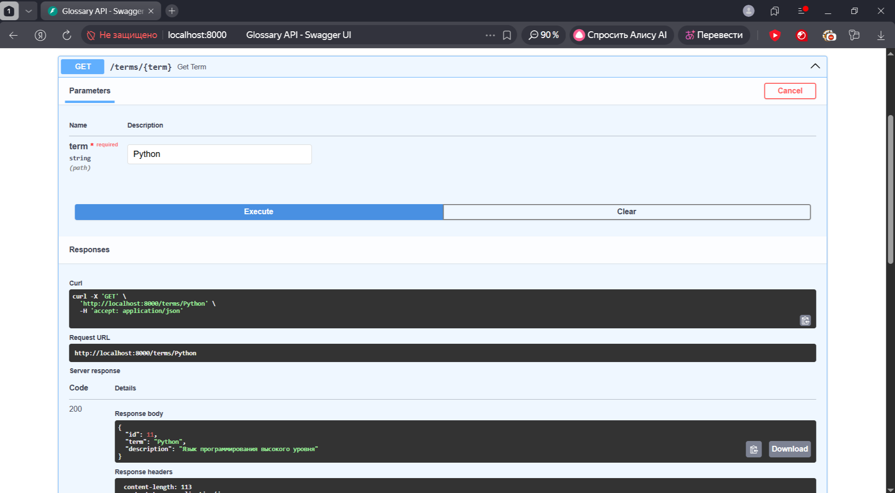
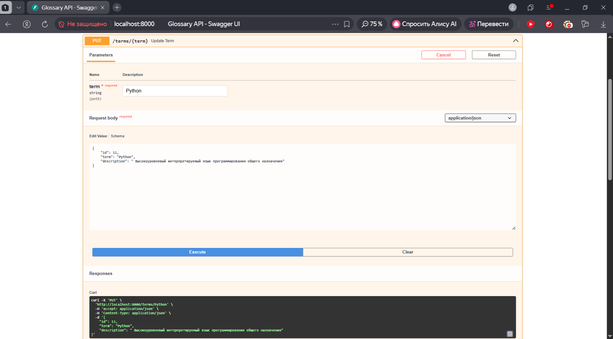
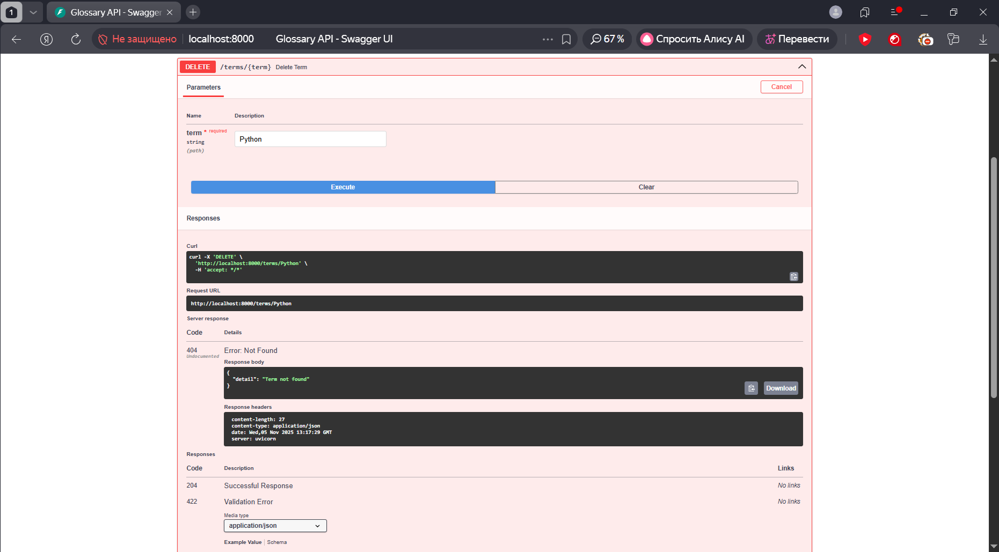

# Rest_fastapi
  python3.11 -m venv .venv && source .venv/bin/activate
  pip install -r requirements.txt
  uvicorn app.main:app --host 0.0.0.0 --port 8000
  http://localhost:8000/terms

  docker build -t glossary-api 
  docker run --rm -p 8000:8000 glossary-api
  docker compose up --build

  скриншоты 

